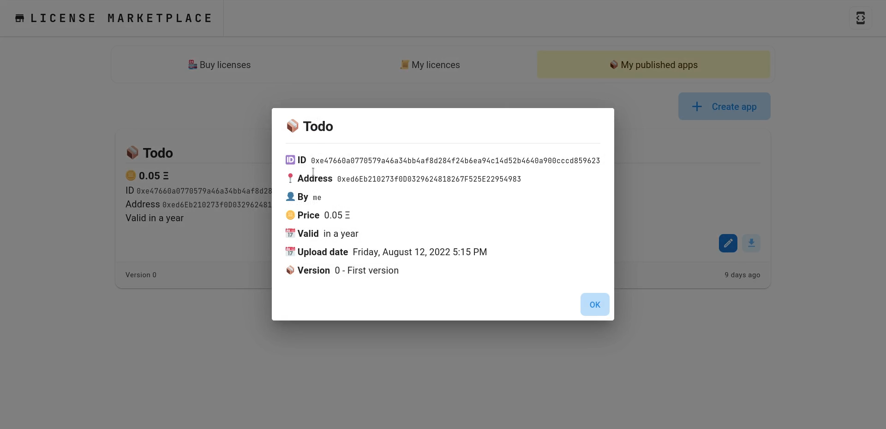

# ĐỒ ÁN CUỐI KÌ MÔN CÁC CÔNG NGHỆ MỚI TRONG PHÁT TRIỂN PHẦN MỀM

## Đề tài: BLOCKCHAIN SOFTWARE LICENCE MANAGEMENT

#### Framework

      Client: ReactJS
      Blockchain: Ethereum Smart Contract (Solidity, Truffle)
      Supporting tools: Ganache, Metamask, IPFS      

### Setup Blockchain - IPFS

1. [Install Truffle](https://trufflesuite.com/docs/truffle/quickstart/)
2. [Install Ganache](https://trufflesuite.com/ganache/)
3. Install IPFS, either [desktop](https://docs.ipfs.tech/install/ipfs-desktop/#windows)
   or [command line](https://docs.ipfs.tech/install/command-line/#system-requirements)

#### Setup Ganache

1. Create new workspace --> Name for new workspace.
2. Add project configuration file (`application-licensing-with-smart-contract/license-contract/truffle-config.js`).
3. Go to Chain tab --> Increase gas limit.
4. Save workspace.

#### Setup IPFS
1. Install IPFS by following the instructions from [IPFS documentation]( https://docs.ipfs.tech/install/)
2. Set the Access-Control-Allow-Origin header and other headers using `ipfs config`

```shell
ipfs config --json API.HTTPHeaders.Access-Control-Allow-Origin '["*"]'
ipfs config --json API.HTTPHeaders.Access-Control-Allow-Methods '["GET", "POST"]'
ipfs config --json API.HTTPHeaders.Access-Control-Allow-Headers '["Authorization"]'
ipfs config --json API.HTTPHeaders.Access-Control-Expose-Headers '["Location"]'
ipfs config --json API.HTTPHeaders.Access-Control-Allow-Credentials '["true"]'
```

3. Run IPFS

```shell
ipfs daemon
```

#### Setup Metamask

1. Install Metamask from the link: https://metamask.io/download/
2. Setup network in Metamask (Go to Settings --> Networks --> Add network)
    1. Fill Network name (e.g Private Network)
    2. Fill RPC URL: HTTP://127.0.0.1:7545
    3. Fill chain ID: 1337
    4. Fill currency symbol: ETH
    5. Click Add

3. Import Account(s) from Ganache to Metamask for testing

#### Deploy truffle
```shell
cd ./license-contract # Navigate to contract directory
truffle deploy
```

#### How to run client

```shell
cd ./client # Navigate to client folder
yarn        # install dependencies
yarn start  # start the development server
```

### Preview




